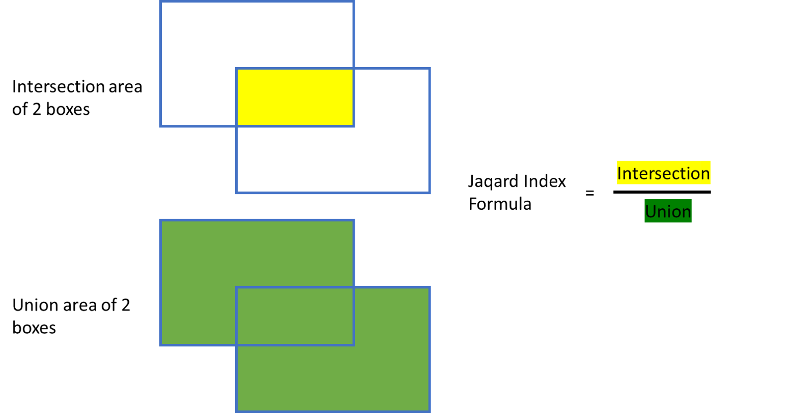

# CorpCorp Box Decisioning Algoritm
## Our Objective
We here at Corpcorp are very concerned with Boxes. People often send us files full of boxes, and we are then responsible for chosing the best boxes out of this file. In order to get only the finest boxes we:
1. Look for overlapping boxes and choose the best 1 based on a formula
2. Remove any poorly ranked boxes

## How do we choose the best boxes? 
Boxes come in CSV files, with 5 columns and a single header record. The columns are 2 integer coordinates (`X,Y`), 2 integer dimensions (`Width,Height`), and one decimal value (`Rank`) (between 0 and 1) representing the Rank. Rank is a representation of how important the box is, with a larger value (e.g 0.8) being more important than a smaller value (e.g. 0.4). There may be an arbitrarily large number of boxes in the file.

The X and Y coordinate refer to the top left corner of the box.

An example of a box file would look like this:
| X | Y | Width | Height | Rank |
|----|----|----|----|----|
| 2 | 2 | 4 | 3 | 0.6 |

This would give a box that looks like this:

The problem is that some of these boxes overlap.
We want to minimise the number of boxes by suppressing some of them. 
Each boxes has a Rank which denotes how important it is. 
Higher rank values supercede lower values.

In order to determine which rectangles will be suppressed, we will use a technique called the Jaccard Index.
The formula for the Jaccard index is `(Intersecting area of the rectangles) divided by (Union of the area of the rectangles)`

If the Intersection over Union (Jaccard Index) is greater than `0.4` (called the Jaccard index threshold), then the box with the lower Rank will be ignored.

In order to make our algorithm faster, we also have a Rank Threshold. Boxes with a Rank lower than `0.5` will be ignored entirely! 

## What outcome do we get
We want a list of all boxes in a file that *do not* get suppressed by the above formula

## What do we want you to do?

### Task 1:
A solution exists in [the src directory](./src). This solution contains a sample [box file](./src/BoxCorp/BoxCorp.App/boxes.csv).  Write a program to satisfy the requirements above. You will be judged based on:
1. Accuracy of the algorithm
2. Code hygiene
3. Performance of the code against a benchmark

### Task 2:
We have written an acceptance criteria with inputs and outputs. You are to write a unit test to validate the results of your code

